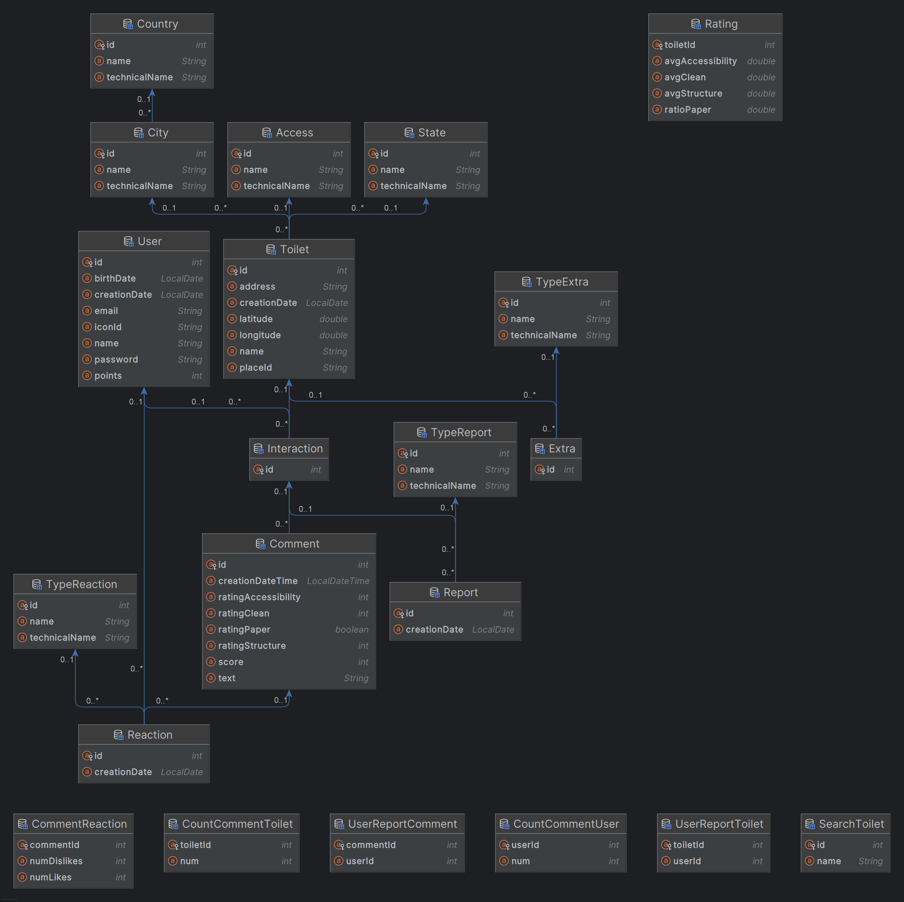

# Think Toilet - [IADE](https://www.iade.europeia.pt/) - [UE](https://www.europeia.pt/)  

**Universidade:** [Universidade Europeia](https://www.europeia.pt/)  
**Faculdade:** [IADE - Faculdade de Design, Tecnologia e Comunicação](https://www.iade.europeia.pt/)  
**Repositório:** [think-toilet](https://github.com/nycocado/think-toilet)  
**Curso:** Engenharia Informática

## Índice
- [Think Toilet - IADE - UE](#think-toilet---iade---ue)
  - [Índice](#índice)
  - [Elementos do Grupo](#elementos-do-grupo)
  - [Versões do Relatório](#versões-do-relatório)
    - [Proposta Inicial](#proposta-inicial)
    - [Relatório Intermédio](#relatório-intermédio)
    - [Relatório Final](#relatório-final)
  - [Palavras-Chave](#palavras-chave)
  - [Descrição](#descrição)
    - [Motivação](#motivação)
    - [Objetivos](#objetivos)
  - [Público-Alvo](#público-alvo)
  - [Pesquisa de Mercado](#pesquisa-de-mercado)
    - [Where is the Toilet](#where-is-the-toilet)
    - [Berlin Toilet](#berlin-toilet)
    - [Flush](#flush)
    - [Where is Public Toilet](#where-is-public-toilet)
  - [Personas](#personas)
    - [Matilde Homão](#matilde-homão)
    - [David Barção](#david-barção)
    - [Maria Cunha](#maria-cunha)
  - [Casos de Utilização](#casos-de-utilização)
    - [Localizar a melhor casa de banho próxima](#localizar-a-melhor-casa-de-banho-próxima)
    - [Feedback da casa de banho](#feedback-da-casa-de-banho)
    - [Pesquisar casa de banho específica](#pesquisar-casa-de-banho-específica)
  - [Descrição da Solução](#descrição-da-solução)
  - [Enquadramento das Unidades Curriculares](#enquadramento-das-unidades-curriculares)
    - [Programação de Dispositivos Móveis](#programação-de-dispositivos-móveis)
    - [Programação Orientada por Objetos](#programação-orientada-por-objetos)
    - [Bases de Dados](#bases-de-dados)
    - [Matemática Discreta](#matemática-discreta)
    - [Projeto de Desenvolvimento Móvel](#projeto-de-desenvolvimento-móvel)
    - [Competências Comunicacionais](#competências-comunicacionais)
  - [Requisitos Técnicos](#requisitos-técnicos)
    - [Requisitos Funcionais](#requisitos-funcionais)
    - [Requisitos Não Funcionais](#requisitos-não-funcionais)
  - [Arquitetura da Solução](#arquitetura-da-solução)
    - [Componentes da Arquitetura](#componentes-da-arquitetura)
      - [Front-end (Aplicação Móvel)](#front-end-aplicação-móvel)
      - [Back-end (Servidor)](#back-end-servidor)
      - [Banco de Dados](#banco-de-dados)
    - [Fluxo de Dados](#fluxo-de-dados)
      - [Login](#login)
      - [Registo](#registo)
      - [Visualização de Casas de Banho Próximas](#visualização-de-casas-de-banho-próximas)
      - [Visualização de Casas de Banho no Mapa](#visualização-de-casas-de-banho-no-mapa)
      - [Busca de Casas de Banho Especificas](#busca-de-casas-de-banho-especificas)
      - [Avaliação de Casas de Banho](#avaliação-de-casas-de-banho)
      - [Denúncia de casas de banho ou comentários](#denúncia-de-casas-de-banho-ou-comentários)
      - [Visualização de Avaliações](#visualização-de-avaliações)
      - [Visualização do Histórico de Avaliações](#visualização-do-histórico-de-avaliações)
      - [Edição do Perfil](#edição-do-perfil)
  - [Tecnologias](#tecnologias)
    - [Desenvolvimento Móvel](#desenvolvimento-móvel)
    - [Desenvolvimento Back-End](#desenvolvimento-back-end)
    - [Bases de Dados](#bases-de-dados-1)
    - [Prototipação](#prototipação)
  - [Divisão de Tarefas](#divisão-de-tarefas)
  - [Planificação](#planificação)
  - [Autoavaliação do Projeto](#autoavaliação-do-projeto)
    - [API e Back-End](#api-e-back-end)
    - [Front-End](#front-end)
    - [Base de Dados](#base-de-dados)
    - [Funcionalidades Implementadas](#funcionalidades-implementadas)
    - [Conformidade com a Proposta](#conformidade-com-a-proposta)
    - [Opinião e Nota Final](#opinião-e-nota-final)
  - [Documentações e Componentes](#documentações-e-componentes)
    - [Diagrama de Classes](#diagrama-de-classes)
    - [Base de Dados (BD Report)](#base-de-dados-bd-report)
    - [Documentação REST](#documentação-rest)
    - [Manual do Utilizador](#manual-do-utilizador)
    - [Banner](#banner)
    - [Video](#video)
    - [Competências Comunicacionais](#competências-comunicacionais-1)
    - [Matemática Discreta](#matemática-discreta-1)
  - [Conclusão](#conclusão)
  - [Bibliografia](#bibliografia)

## Elementos do Grupo
- [Nycolas Souza](https://github.com/nycocado) - 20230989
- [Luan Ribeiro](https://github.com/Ninjaok) - 20230692
- [Lohanne Guedes](https://github.com/Lohannecristina) - 20220085

## Versões do Relatório
### Proposta Inicial
- [Markdown](README-proposta.md)
- [PDF](documents/primeira_entrega/g04-proposta.pdf)

### Relatório Intermédio
- [Markdown](README-relatorio-intermedio.md)
- [PDF](documents/segunda_entrega/g04-relatorio-intermedio.pdf)

### Relatório Final
- [Markdown](README.md)
- [PDF](documents/terceira_entrega/g04-relatorio-final.pdf)

## Palavras-Chave
Localizador; Avaliação; Sanitários; Casa de banho; Público; Privada; Busca; Próximas; Aplicação; Mobile; Guia; Navegação; Google Maps; Encontrar; Rotas; Busca; Mapa; Interativo; App; Recomendação;

## Descrição
O **[Think Toilet](https://github.com/nycocado/think-toilet)** é uma aplicação móvel projetada para resolver um problema comum: localizar casas de banho limpas e acessíveis. Muitas vezes, as pessoas enfrentam dificuldades para encontrar uma casa de banho, especialmente em situações de emergência ou em áreas desconhecidas.

### Motivação
O **["Spreadshit"](https://exame.com/pop/spreadshit-planilha-avalia-banheiros-empresas/)** foi um evento viral em 2022 que popularizou reviews humorísticas de casas de banho. A pandemia de COVID-19, que levou ao fechamento de muitos banheiros públicos, fez com que encontrar um banheiro acessível se tornasse um desafio.

Com o fechamento de estabelecimentos e preocupações sobre a limpeza dos banheiros disponíveis, as pessoas começaram a compartilhar suas experiências online, formando uma comunidade disposta a ajudar na busca por opções mais seguras e limpas.

Além disso, muitos sistemas de busca de banheiros não são atualizados, complicando a vida dos usuários. Com isso, percebemos a necessidade de uma solução prática e eficaz. Portanto, desenvolvemos uma aplicação capaz de ajudar as pessoas a encontrar casas de banho limpas e acessíveis, permitindo também a avaliação, criando um banco de dados mais confiável e útil.

### Objetivos
- Facilitar a busca de casas de banho limpas e próximas.
- Permitir um ambiente saudável para o desenvolvimento da comunidade.
- Avaliação e feedback contínuos.
- Integração com mapas e navegação.

## Público-Alvo
O público-alvo da aplicação **[Think Toilet](https://github.com/nycocado/think-toilet)** inclui:
- Trabalhadores em trânsito, como motoristas e entregadores, que frequentemente necessitam de acesso a casas de banho durante o trabalho.
- Turistas e viajantes que estão explorando novas áreas e precisam localizar sanitários próximos.
- Pessoas com necessidades de acessibilidade, que buscam informações sobre instalações adaptadas.
- Profissionais que trabalham em campo, como trabalhadores da construção civil e eletricistas, que podem não ter acesso a instalações adequadas durante o dia de trabalho.

## Pesquisa de Mercado
A nossa pesquisa sobre aplicativos para busca de casas de banho foi um dos principais motivos para a escolha do tema do projeto. A maioria deles apresenta uma interface deficiente e poucas funções úteis além da localização dos sanitários.

### [Where is the Toilet](https://play.google.com/store/apps/details?id=com.iisrl.toilet.star.toilet_star&hl=pt_PT)
A aplicação funciona como um localizador de casas de banho, permitindo avaliações e a criação de novas.
- **Pontos Positivos:** Interface limpa, sem informações desnecessárias, facilitando a navegação.
- **Pontos Negativos:** Poucas casas de banho disponíveis. Apesar de parecer italiana, não encontramos opções na Itália. O sistema de busca é pouco intuitivo e o mapa não atualiza automaticamente, sendo necessário clicar para mostrar as casas de banho próximas.
- **Melhorias Feitas:** Automátização do mapa, mostrando as casas de banho próximas sem a necessidade de clicar.

### [Berlin Toilet](https://play.google.com/store/apps/details?id=com.futurice.berlintoiletapp&hl=pt_PT)
É uma aplicação para localização de casas de banho, utilizando o Google Maps para indicar direções e permitindo avaliações categóricas.
- **Pontos Positivos:** Sistema de localização intuitivo, permite saber se o estabelecimento é pago e oferece acessibilidade.
- **Pontos Negativos:** Interface fraca, não permite comentários sobre as casas de banho e as notas dos utilizadores não aparecem de forma imediata.
- **Melhorias Feitas:** Exibir a média de notas dos utilizadores na tela inicial para facilitar a escolha, permitir comentários e melhorar a interface.

### [Flush](https://play.google.com/store/apps/details?id=toilet.samruston.com.toilet&hl=pt_PT)
Aplicação de localização de casas de banho.
- **Pontos Positivos:** Localiza rapidamente banheiros no mapa, indicando se são pagos, acessíveis ou trancados. Permite criar casas de banho e reportar problemas.
- **Pontos Negativos:** Falta filtragem nas criações, avaliações e comentários não aparecem, não mostra as casas de banho mais próximas e não permite traçar rotas.
- **Melhorias Feitas:** Exibir avaliações e comentários, mostrar as mais próximas e permitir rotas.

### [Where is Public Toilet](https://play.google.com/store/apps/details?id=sfcapital.publictoiletinsouthaustralia&hl=pt_PT)
Aplicativo para localizar banheiros públicos, com informações úteis como avaliações e acessibilidade.
- **Pontos Positivos:** Lista de banheiros por distância, com avaliações, horários de funcionamento, favoritos e compartilhamento. Mostra pins no mapa e oferece rota.
- **Pontos Negativos:** Necessita baixar o banco de dados a cada instalação, o que é demorado. Não possui comentários e a interface é confusa e pouco intuitiva.
- **Melhorias Feitas:** Simplificar a interface, permitir comentários e avaliações, e facilitar a navegação.

## Personas  
### Matilde Homão  
- **Idade:** 21 anos
- **Sexo:** Feminino
- **Ocupação:** Motorista de aplicação e Estudante
- **Descrição:** Matilde é uma jovem motorista de aplicação que enfrenta diversos desafios no seu dia a dia, como deslocar-se por diferentes locais e gerir a rotina entre o trabalho e os estudos numa universidade de prestígio.
- **Objetivo:** Devido à natureza dinâmica do seu trabalho como motorista de aplicação, Matilde precisa localizar de forma rápida e eficiente casas de banho de qualidade em diferentes regiões.
- **Frustrações:** Dificuldade em encontrar casas de banho em locais desconhecidos ou remotos.

### David Barção
- **Idade:** 20 anos
- **Sexo:** Masculino
- **Ocupação:** Turista e Empreendedor 
- **Descrição:** David é um jovem empreendedor em busca de autoconhecimento, decidido a explorar o mundo após desenvolver uma carreira de sucesso. Viajar é a sua forma de se conectar consigo mesmo e com diferentes culturas.
- **Objetivo:** David procura as rotas mais eficientes para explorar novos países e, durante as suas viagens, precisa localizar casas de banho confortáveis e acessíveis em diferentes regiões.
- **Frustrações:** Devido às suas constantes viagens, David frequentemente desconhece as características e comodidades das regiões onde irá pernoitar. Por isso, sente a necessidade de uma aplicação que facilite a localização de casas de banho confortáveis e próximas.

### Maria Cunha
- **Idade:** 39 anos
- **Sexo:** Feminino
- **Ocupação:** Jornalista, Dentista e Gestante 
- **Descrição:** Maria, mãe diagnosticada com Síndrome de Laron, cuida de um bebé de 8 meses e enfrenta os desafios de uma rotina intensa. Para lidar com as necessidades do seu filho, precisa estar sempre preparada para trocar fraldas e oferecer cuidados adequados, mesmo em locais fora de casa.
- **Objetivo:** Localizar rapidamente casas de banho equipadas com fraldários que atendam a altos padrões de limpeza e conforto.
- **Frustrações:** Devido à sua rotina corrida, Maria encontra dificuldades em encontrar casas de banho adequadas e bem equipadas para cuidar do seu bebé, o que adiciona stress à sua jornada diária.

## Casos de Utilização
### Localizar a melhor casa de banho próxima
**Persona: Matilde Homão**  
Consideramos a localização da melhor casa de banho próxima como o objetivo principal do projeto, seguindo estes passos:
- Matilde encontra-se num local desconhecido e precisa urgentemente de uma casa de banho.
- A Matilde acede à aplicação e visualiza o mapa. 
- No mapa, são exibidas as casas de banho mais próximas, já na parte inferior, aparece a primeira casa de banho, e Matilde pode deslizar para ver as cinco opções mais próximas.
- Independentemente do método escolhido para aceder à casa de banho, o Matilde será redirecionado para a janela da casa de banho escolhida.
- Nessa janela, o Matilde pode clicar no botão escrito "Abrir no Maps", que o levará ao Google Maps, onde poderá escolher a rota até à casa de banho.

### Feedback da casa de banho
**Persona: Maria Cunha**  
O segundo caso envolve a avaliação de uma casa de banho:
- Maria utilizou uma casa de banho e gostaria de avaliar a excelente experiência que teve, compartilhando seu feedback positivo sobre a limpeza, conforto e acessibilidade do local.
- O Maria acede à aplicação e visualiza o mapa.
- No mapa, são exibidas as casas de banho mais próximas, já na parte inferior, destaca-se a primeira casa de banho que Maria utilizou, seguindo a recomendação da aplicação.
- Após selecionar a primeira casa de banho, o Maria é redirecionado para a janela da casa de banho selecionada.
- Nessa janela, o Maria clica no botão "Avaliar" e é levado à tela de avaliações.
- Maria pode comentar sobre a sua experiência e avaliar categorias como "Limpeza", "Papel", "Estrutura" e "Acessibilidade".
- Para concluir, o Maria clica no botão de confirmação para publicar a sua avaliação.

### Pesquisar casa de banho específica
**Persona: David Barção**  
Este caso trata da busca por uma casa de banho específica pelo utilizador:
- David viajou para Lisboa, um destino que nunca havia visitado antes. Agora, hospedado em seu hotel, ele deseja planejar sua viagem como turista, explorando a capital de Portugal e seus principais pontos turísticos
- David acede à aplicação e visualiza o mapa.
- Na parte superior, clica no botão de pesquisa.
- O teclado é acionado, e o utilizador pode digitar a localização ou o nome do estabelecimento onde a casa de banho se encontra.
- Após a pesquisa, a aplicação exibe a casa de banho desejada, e David pode clicar para visualizar mais detalhes e avaliações.
- David pode então escolher a melhor rota para chegar à casa de banho, clicando no botão "Abrir no Maps".

## Descrição da Solução
O projeto **[Think Toilet](https://github.com/nycocado/think-toilet)** é uma aplicação móvel que ajuda os utilizadores a encontrar e avaliar casas de banho próximas. A aplicação exibe um mapa interativo com as casas de banho mais bem avaliadas e fornece informações adicionais, incluindo avaliações de usuários. Os utilizadores podem avaliar critérios como limpeza, acessibilidade, papel disponível e estrutura, além de deixar comentários. A aplicação também permite denunciar locais ou comentários inadequados e visualizar seu histórico de avaliações. Com integração ao Google Maps, oferece rotas para facilitar o acesso aos locais.

## Enquadramento das Unidades Curriculares
### Programação de Dispositivos Móveis
O desenvolvimento mobile foi realizado em **[Kotlin](https://kotlinlang.org)**, utilizando **[Jetpack Compose](https://developer.android.com/compose)** como framework principal. Aplicamos os conhecimentos adquiridos na unidade curricular, como a criação de interfaces intuitivas, navegação entre telas, integração com APIs e gerenciamento de dados locais. A aplicação foi projetada para oferecer uma experiência de usuário fluida, responsiva e eficiente.

### Programação Orientada por Objetos  
O Back-End do projeto foi desenvolvido em **[Java](https://www.java.com/)** com o framework **[Spring Boot](https://spring.io)**, conectando a interface ao banco de dados. A arquitetura **REST** foi implementada para criar uma API modular e intuitiva, facilitando a comunicação entre o front-end e o back-end. O padrão **MVC** (Model-View-Controller) foi utilizado para separar a lógica de negócios, interface e dados, promovendo organização e escalabilidade. Aplicando também conhecimentos da programação orientada a objetos, como encapsulamento e herança, garantimos um código limpo e eficiente. Além disso, utilizamos **UML** para representação.

### Bases de Dados
O sistema de armazenamento utilizou **[MySQL](https://www.mysql.com/)**, aplicando conceitos como tabelas, chaves primárias e estrangeiras, além de consultas SQL otimizadas para manipulação e recuperação de dados. A estrutura relacional do banco garante integridade, eficiência e segurança das informações, permitindo uma gestão confiável dos dados do projeto.

### Matemática Discreta
Conceitos de teoria de conjuntos foram aplicados no desenvolvimento de estruturas de dados, como a representação de casas de banho e suas relações com outras tabelas do banco de dados. Essa abordagem permitiu uma integração consistente e eficiente dos dados, garantindo um sistema robusto.

### Projeto de Desenvolvimento Móvel
A unidade curricular desempenhou um papel central na planificação e gestão do projeto. Utilizamos ferramentas como o **[ClickUp](https://clickup.com/)** para organização e controle de tarefas, assegurando o cumprimento de prazos. Feedbacks de design e avaliações periódicas foram fundamentais para aprimorar a qualidade do projeto, além de desenvolver habilidades técnicas e interpessoais.

### Competências Comunicacionais
A comunicação eficaz foi essencial durante o desenvolvimento do projeto. Aplicamos as técnicas aprendidas na unidade curricular em apresentações e reuniões, além de utilizá-las na interação com a comunidade de usuários e na coleta de feedback. Esses esforços contribuíram para um projeto mais alinhado às necessidades dos utilizadores e melhoraram a colaboração entre os membros da equipe.

## Requisitos Técnicos
### Requisitos Funcionais
- Os usuários devem poder buscar casas de banho próximas por localização no mapa.
- Os usuários devem poder visualizar detalhes das casas de banho e avaliações, com a média das avaliações categóricas e a média geral das avaliações.
- Os usuários devem poder avaliar casas de banho, deixando comentários e notas sobre limpeza, acessibilidade, disponibilidade de papel e estrutura.
- Os usuários devem poder ver seu histórico de avaliações.
- Os usuários devem poder editar seu perfil, incluindo nome, e-mail, senha e foto de perfil.
- A aplicação deve permitir que os usuários denunciem locais ou comentários inadequados.
- Os usúarios obrigatoriamente devem ser registrados e ter uma conta na plataforma para poder interagir com a comunidade

### Requisitos Não Funcionais
- A interface deve ser intuitiva e responsiva, proporcionando uma experiência de usuário agradável.
- O sistema deve permitir a moderação eficiente de comentários e sugestões, incluindo a análise de conteúdo para determinar se ele deve ser mantido, editado ou removido.
- A aplicação deve ser compatível com [Android 9 (API Level 28)]((https://developer.android.com/tools/releases/platforms#9.0)) ou superior.
- Deve ser utilizado [Kotlin](https://kotlinlang.org) com [Jetpack Compose](https://developer.android.com/compose) para a interface do usúario.
- Deve ser utilizado [Java](https://www.java.com/) com [Spring Boot](https://spring.io) para manipulação de dados.
- Utilização de [MySQL](https://www.mysql.com/) para o armazenamento de dados, incluindo informações sobre usuários, casas de banho, avaliações e sugestões.
- Informações sensíveis, como senhas de usuários, devem ser armazenadas de forma segura e criptografada.
- A aplicação deve ser escalável e modular, permitindo a adição de novos recursos e funcionalidades no futuro.
- Integração com o [Google Maps API](https://developers.google.com/maps) para fornecer direções e rotas para as casas de banho.
- Integração com o [OpenStreetMap](https://www.openstreetmap.org) para visualização de mapas e localização de casas de banho.

## Arquitetura da Solução  
A arquitetura da solução do projeto **[Think Toilet](https://github.com/nycocado/think-toilet)** foi projetada para ser modular e escalável, abrangendo três componentes principais: o front-end (aplicação móvel), o back-end (servidor) e o banco de dados.

### Componentes da Arquitetura
#### Front-end (Aplicação Móvel)  
Desenvolvida em **[Kotlin](https://kotlinlang.org)** com **[Jetpack Compose](https://developer.android.com/compose)** para a interface de usuário, a aplicação permite aos usuários buscar casas de banho, visualizar detalhes e fazer avaliações. A integração com o **[Google Maps API](https://developers.google.com/maps)** e **[OpenStreetMap](https://www.openstreetmap.org)** facilita a navegação e localização de casas de banho próximas.

#### Back-end (Servidor)  
Construído com **[Java](https://www.java.com/)** e **[Spring Boot](https://spring.io)**, o servidor implementa uma arquitetura RESTful para facilitar a comunicação entre o front-end e o back-end. Ele gerencia dados sobre casas de banho, avaliações e usuários, garantindo a integridade das informações.

#### Banco de Dados  
Utilizando **[MySQL](https://www.mysql.com/)**, o banco de dados foi projetado para armazenar informações sobre usuários, casas de banho, avaliações e sugestões. A estrutura relacional garante eficiência nas consultas e integridade dos dados.

### Fluxo de Dados
#### Login
1. **Início da Requisição**
   - O usuário abre a aplicação e decide fazer login.
   - A aplicação solicita informações como e-mail e senha.
   - O usuário envia as informações para o servidor.
2. **Processamento pelo Servidor**
    - O servidor processa a requisição, verificando as credenciais do usuário no banco de dados.
    - O servidor retorna uma confirmação ao front-end.
3. **Resposta ao Usuário**
    - O front-end exibe uma confirmação do login, permitindo ao usuário acessar a aplicação.

#### Registo
1. **Início da Requisição**
   - O usuário abre a aplicação e decide se registrar.
   - A aplicação solicita informações como nome, e-mail e senha.
   - O usuário envia as informações para o servidor.
2. **Processamento pelo Servidor**
    - O servidor processa a requisição, armazenando as informações do usuário no banco de dados.
    - O servidor retorna uma confirmação ao front-end.
3. **Resposta ao Usuário**
    - O front-end exibe uma confirmação do registo, permitindo ao usuário acessar a aplicação.

#### Visualização de Casas de Banho Próximas
1. **Início da Requisição**
   - O usuário abre a aplicação e visualiza o mapa.
   - A aplicação recolhe os dados de localização de usuário, e envia uma requisição ao servidor. (Apenas se o usuário permitir a localização)
2. **Processamento pelo Servidor**
   - O servidor processa a requisição, ordenando a consulta das casas de banho pela distância do usuário.
   - O servidor retorna os dados das casas de banho ao front
3. **Resposta ao Usuário**
   - O front-end exibe as casas de banho mais próximas no menu inferior, permitindo ao usuário visualizar detalhes das casas de banho.

#### Visualização de Casas de Banho no Mapa
1. **Início da Requisição**
   - O usuário abre a aplicação e visualiza o mapa.
   - Assim que o mapa da aplicação é carregado, a aplicação envia uma requisição ao servidor com as informações de extremidades do mapa, como norte, sul, leste e oeste.
2. **Processamento pelo Servidor**
    - O servidor processa a requisição, filtrando as casas de banho que estão dentro dos limites do mapa.
    - O servidor retorna os dados das casas de banho ao front-end.
3. **Resposta ao Usuário**
    - O front-end exibe as casas de banho no mapa, permitindo ao usuário visualizar detalhes das casas de banho ao clicar no pin.

#### Busca de Casas de Banho Especificas
1. **Início da Requisição**
   - O usuário pesquisa casas de banho na aplicação, por meio da barra de pesquisa.
   - A cada alteração do texto na barra de pesquisa, uma requisição é enviada ao servidor com o texto digitado.
2. **Processamento pelo Servidor**
    - O servidor processa a requisição, usando um mecanismo de FTS (Full-Text Search) para encontrar casas de banho correspondentes.
    - O servidor retorna os dados das casas de banho correspondentes ao front-end.
3. **Resposta ao Usuário**
    - O front-end exibe as casas de banho correspondentes na tela, permitindo ao usuário visualizar detalhes da casa de banho que selecionar.

#### Avaliação de Casas de Banho
1. **Início da Requisição**
   - O usuário seleciona uma casa de banho e fornece uma avaliação.
   - A aplicação recebe informações de texto e notas do usuário.
   - A aplicação envia uma requisição ao servidor com os dados da avaliação.
2. **Processamento pelo Servidor**
    - O servidor processa a requisição, armazenando a avaliação no banco de dados.
    - O servidor retorna uma confirmação ao front-end.
3. **Resposta ao Usuário**
    - O front-end exibe uma confirmação da avaliação, permitindo ao usuário visualizar a avaliação na casa de banho.

#### Denúncia de casas de banho ou comentários
1. **Início da Requisição**
   - O usuário denuncia uma casa de banho ou comentário inadequado.
   - A aplicação envia uma requisição ao servidor com os dados da denúncia (Indicando por exemplo, o motivo, qual casa de banho ou comentário e o usuário que fez a denúncia).
2. **Processamento pelo Servidor**
    - O servidor processa a requisição, armazenando a denúncia no banco de dados.
    - O servidor retorna uma confirmação ao front-end.
3. **Resposta ao Usuário**
    - O front-end exibe uma confirmação da denúncia, a partir daí o usuário deixa de visualizar a casa de banho ou comentário denunciado.

#### Visualização de Avaliações
1. **Início da Requisição**
   - O usuário requisita ao servidor as avaliações daquela casa de banho ao qual ele selecionou.
   - A aplicação envia uma requisição ao servidor com o ID da casa de banho.
2. **Processamento pelo Servidor**
    - O servidor processa a requisição, buscando no banco de dados as avaliações da casa de banho.
    - O servidor retorna as avaliações ao front-end.
3. **Resposta ao Usuário**
    - O front-end exibe as avaliações da casa de banho, permitindo ao usuário visualizar os comentários e notas.
- **Observação:** Esse fluxo é vinculado a uma busca de reações daqueles comentários, a fim de saber se o usuário deu like ou dislike previamente.

#### Visualização do Histórico de Avaliações
1. **Início da Requisição**
   - O usuário solicita visualizar seu histórico de avaliações.
   - A aplicação envia uma requisição ao servidor para obter o histórico de avaliações do usuário.
2. **Processamento pelo Servidor**
    - O servidor processa a requisição e retorna o histórico de avaliações ao front-end.
    - O servidor retorna as avaliações ao front-end.
3. **Resposta ao Usuário**
    - O front-end exibe o histórico de avaliações do usuário, permitindo visualizar as avaliações feitas anteriormente.

#### Edição do Perfil
1. **Início da Requisição**
   - O usuário solicita editar seu perfil (nome, ícone, senha, etc).
   - A aplicação envia uma requisição ao servidor com os dados a serem alterados.
2. **Processamento pelo Servidor**
    - O servidor processa a requisição, atualizando os dados do usuário no banco de dados.
    - O servidor retorna uma confirmação ao front-end.
3. **Resposta ao Usuário**
    - O front-end exibe uma confirmação da edição do perfil, permitindo ao usuário visualizar as alterações feitas.

## Tecnologias
### Desenvolvimento Móvel
- **Linguagem:** [Kotlin](https://kotlinlang.org)
- **Framework:** [Jetpack Compose](https://developer.android.com/compose)
- **SDK:** [Android SDK 28](https://developer.android.com/tools/releases/platforms#9.0)
- **Integração:** [Google Maps API](https://developers.google.com/maps) e [OpenStreetMap API](https://wiki.openstreetmap.org/wiki/API)

### Desenvolvimento Back-End
- **Linguagem:** [Java](https://www.java.com/)
- **Framework:** [Spring Boot](https://spring.io)

### Bases de Dados
- **Sistema de Gerenciamento:** [MySQL](https://www.mysql.com/)
- **Conexão:** via [Java](https://www.java.com/) com [Spring Boot](https://spring.io)

### Prototipação
- **Software:** [Figma](https://www.figma.com/) para design e prototipação da interface do usuário.

## Divisão de Tarefas
**Observação:** A divisão de tarefas foi realizada principalmente com base na disponibilidade de cada membro da equipe, além de algumas tarefas serem mais simples do que outras, como o diagrama de classes, que foi criado diretamente no IntelliJ IDEA. Portanto, o cálculo não deve ser feito pela média geral.

| Categoria        | Tarefa                                                       | Nycolas | Lohanne | Luan  |
| ---------------- | ------------------------------------------------------------ | ------- | ------- | ----- |
| Front-End        | Telas Essenciais (Home, History, Profile e Rating)        | 35%     | 27.5%   | 37.5% |
| Front-End        | Telas Não-Essenciais (Report, Login, Register e Settings) | 40%     | 5%      | 55%   |
| Front-End        | Conexão com o Back-End                                       | 80%     | 10%     | 10%   |
| Front-End        | Componentes                                                  | 35%     | 30%     | 35%   |
| Front-End        | Sistema de Pesquisa                                          | 90%     | 0%      | 10%   |
| Front-End        | Integração com o Mapa                                        | 85%     | 10%     | 5%    |
| Front-End        | Aperfeiçoamento                                              | 33.3%   | 33.3%   | 33.3% |
| Back-End         | Endpoints de Busca                                           | 90%     | 5%      | 5%    |
| Back-End         | Endpoints de Postagem                                        | 90%     | 5%      | 5%    |
| Back-End         | Login e Registo                                              | 90%     | 5%      | 5%    |
| Back-End         | Integração de Chaves de API                                  | 100%    | 0%      | 0%    |
| Base de Dados    | Script de Criação                                            | 10%     | 90%     | 0%    |
| Base de Dados    | Script de População                                          | 20%     | 80%     | 0%    |
| Base de Dados    | Queries                                                      | 10%     | 45%     | 45%   |
| Primeira Entrega | Relatório                                                    | 50%     | 20%     | 30%   |
| Primeira Entrega | Guiões de Teste                                              | 40%     | 20%     | 40%   |
| Primeira Entrega | Project Charter e WBS                                        | 45%     | 10%     | 45%   |
| Primeira Entrega | Mockups e Interfaces                                         | 33.3%   | 33.3%   | 33.3% |
| Primeira Entrega | Gráfico de Gantt                                             | 0%      | 20%     | 80%   |
| Primeira Entrega | Vídeo                                                        | 40%     | 30%     | 30%   |
| Primeira Entrega | Banner                                                       | 10%     | 80%     | 10%   |
| Segunda Entrega  | Atualização do Relatório                                     | 60%     | 20%     | 20%   |
| Segunda Entrega  | Atualização dos Guiões de Teste                              | 10%     | 10%     | 80%   |
| Segunda Entrega  | Personas                                                     | 0%      | 30%     | 70%   |
| Segunda Entrega  | Diagrama de Classes                                          | 100%    | 0%      | 0%    |
| Segunda Entrega  | Modelo Entidade-Relacionamento                               | 33.3%   | 33.3%   | 33.3% |
| Segunda Entrega  | Documentação REST                                            | 80%     | 10%     | 10%   |
| Segunda Entrega  | Dicionário de Dados                                          | 20%     | 70%     | 10%   |
| Segunda Entrega  | Guia de Dados                                                | 30%     | 40%     | 30%   |
| Terceira Entrega | Atualização do Relatório                                     | 80%     | 10%     | 10%   |
| Terceira Entrega | Atualização da Documentação REST                             | 80%     | 10%     | 10%   |
| Terceira Entrega | Atualização do Diagrama de Classes                           | 100%    | 0%      | 0%    |
| Terceira Entrega | Atualização dos Casos de Utilização                          | 40%     | 20%     | 40%   |
| Terceira Entrega | Atualização do Dicionário de Dados                           | 40%     | 30%     | 30%   |
| Terceira Entrega | Atualização do Guia de Dados                                 | 40%     | 30%     | 30%   |
| Terceira Entrega | Atualização do Gráfico de Gantt                              | 0%      | 20%     | 80%   |
| Terceira Entrega | Relatório de Competências Comunicacionais                    | 15%     | 15%     | 70%   |
| Terceira Entrega | Relatório de Matemática Discreta                             | 33.3%   | 33.3%   | 33.3% |
| Terceira Entrega | Manual do Utilizador                                         | 5%      | 90%     | 5%    |
| Terceira Entrega | Vídeo                                                        | 40%     | 40%     | 20%   |
| Terceira Entrega | Banner                                                       | 0%      | 100%    | 0%    |

## Planificação 
[Gráfico de Gantt](documents/terceira_entrega/gantt/gantt.pdf)  
[ClickUp](https://app.clickup.com/9012385337/v/s/90121980334)

## Autoavaliação do Projeto
O ThinkToilet é um projeto que se destaca pela criatividade, atenção aos detalhes e pela dedicação em construir uma aplicação funcional, segura e intuitiva. Segue uma análise detalhada das áreas mais relevantes:
### API e Back-End  
A API foi desenvolvida seguindo boas práticas de arquitetura e design. Os endpoints são bem estruturados, e o tratamento de erros é robusto, com mensagens claras e informativas, que auxiliam no processo de debugging, tornando agradavel para desenvolvedores. Além disso, o sistema se mostrou escalável e flexível, pronto para futuras expansões.

Um destaque importante é o cuidado com segurança. O back-end implementa:
- **Criptografia de senhas com o método bcrypt**, garantindo a proteção dos dados sensíveis dos usuários.
- **Uso de chaves de API**, reforçando a autenticação e a segurança no acesso aos recursos.
Essas implementações demonstram a preocupação em proteger as informações dos usuários e mitigar riscos de segurança.

### Front-End
O front-end foi desenvolvida focando na usabilidade e experiência do usuário. A interface é limpa, intuitiva e responsiva, adaptando-se a diferentes dispositivos e tamanhos de tela. A integração com o Google Maps e OpenStreetMap API foi bem executada, proporcionando uma navegação suave e eficiente.
Em especial, destacam-se:
- **Aplicação bilíngue (português e inglês)**, ampliando o alcance e tornando o sistema mais inclusivo.
- **Modo escuro**, cuidadosamente projetado com uma paleta de cores que garante conforto visual.
- **Mapa interativo**, integrado com OpenStreetMap, que substituiu a Google Maps API de forma eficaz e econômica.

### Base de Dados
O banco de dados foi projetado de forma eficiente, com uma estrutura bem normalizada e otimizada para consultas rápidas e precisas. O dicionario de dados e o guia de dados fornecem informações detalhadas sobre as tabelas, campos e relacionamentos, facilitando a compreensão e manutenção do banco. As queries foram bem elaboradas, com uso adequado de índices e cláusulas para garantir a performance e integridade dos dados.
- **Dados georreferenciados** para casas de banho, permitindo consultas otimizadas por localização e integração fluida com o mapa interativo no frontend.
- **Suporte a consultas paginadas**, essencial para a busca de casas de banho e para manter a performance em listas grandes.

### Funcionalidades Implementadas
O ThinkToilet apresenta um conjunto robusto de funcionalidades:

- **Sistema de busca com paginação**, essencial para lidar com grandes volumes de dados.
- **Login e registro de usuários**, com autenticação segura.
- **Avaliações detalhadas de casas de banho**, com cálculo de médias ponderadas.
- **Histórico de interações e avaliações** para os usuários.
- **Edição de informações do usuário**, adicionada como funcionalidade extra ao escopo inicial.
- **Denúncia de casas de banho e comentários**, promovendo um ambiente seguro e colaborativo.
- **Possibilidade de traçar rotas** para as casas de banho, com integração ao Google Maps.

### Conformidade com a Proposta
O projeto atende à proposta inicial, entregando todas as funcionalidades principais e até superando expectativas em alguns aspectos. As mudanças realizadas, como a troca da Google Maps API pelo OpenStreetMap, foram bem fundamentadas e executadas, embora a funcionalidade de sugestão de casas de banho pelos usuários tenha sido cortada devido a restrições de tempo.

### Opinião e Nota Final
O ThinkToilet é um projeto completo, tecnicamente sólido e bem pensado. A integração eficiente entre back-end, banco de dados e front-end, somada às preocupações com segurança, usabilidade e escalabilidade, demonstra o compromisso com a entrega de um produto de alta qualidade.

**Nota sugerida:** 19/20

O projeto merece uma nota alta pelo excelente trabalho. A ausência da funcionalidade de sugestão de casas de banho é um pequeno detalhe que impede a perfeição, mas isso é amplamente compensado pela qualidade do projeto desenvolvido e adições que superaram as expectativas iniciais.

## Documentações e Componentes
### Diagrama de Classes

### Base de Dados (BD Report)
- [Dicionário de Dados - PDF](documents/terceira_entrega/g04-dicionario-de-dados-v2.pdf)
- [Guia de Dados - PDF](documents/terceira_entrega/g04-guia-de-dados-v2.pdf)

### Documentação REST
- [Markdown](RESTDOC.md)
- [PDF](documents/terceira_entrega/g04-restdoc-v2.pdf)

### Manual do Utilizador
- [PDF](documents/terceira_entrega/g04-manual-do-utilizador.pdf)

### Banner
- [PDF](documents/terceira_entrega/banner/banner-g4.pdf)
- [PNG](documents/terceira_entrega/banner/banner-g4.png)

### Video

### Competências Comunicacionais
- [PDF](documents/terceira_entrega/g04-competencias-comunicacionais.pdf)

### Matemática Discreta
- [PDF](documents/terceira_entrega/g04-matematica-discreta.pdf)

## Conclusão
O **[Think Toilet](https://github.com/nycocado/think-toilet)** tem como principal objetivo fornecer uma solução eficaz para facilitar a localização de casas de banho públicas e privadas, ao mesmo tempo que melhora a experiência do utilizador através de um sistema de avaliações detalhadas. A aplicação permite que os utilizadores encontrem rapidamente casas de banho próximas, com base em critérios como limpeza e acessibilidade. Além disso, o projeto visa promover a colaboração dos utilizadores através de avaliações, criando assim um banco de dados sempre atualizado e confiável.

Com a integração ao [Google Maps](https://www.google.pt/maps), a aplicação também visa facilitar o acesso, fornecendo rotas diretas para os utilizadores. Ao final, **[Think Toilet](https://github.com/nycocado/think-toilet)** busca não apenas atender a uma necessidade prática, mas também criar uma comunidade de utilizadores colaborativa e engajada, proporcionando uma solução abrangente e útil para o cotidiano de todos.

## Bibliografia
- [Spreadshit: por trás da famosa planilha que avalia banheiros de empresas - Revista Exame](https://exame.com/pop/spreadshit-planilha-avalia-banheiros-empresas/)
- [Where is the Toilet - Jaser182](https://play.google.com/store/apps/details?id=com.iisrl.toilet.star.toilet_star&hl=pt_PT)
- [Berlin Toilet - WallDecaux](https://play.google.com/store/apps/details?id=com.futurice.berlintoiletapp&hl=pt_PT)
- [Flush - Sam Ruston](https://play.google.com/store/apps/details?id=toilet.samruston.com.toilet&hl=pt_PT)
- [Where is Public Toilet - sfcapital](https://play.google.com/store/apps/details?id=sfcapital.publictoiletinsouthaustralia&hl=pt_PT)
- [Kotlin - Jetbrains](https://kotlinlang.org)
- [Jetpack Compose - Google](https://developer.android.com/compose)
- [Android Studio - Google](https://developer.android.com)
- [Google Maps - Google](https://www.google.pt/maps)
- [Google Maps API - Google](https://developers.google.com/maps)
- [OpenStreetMap - OpenStreetMap](https://www.openstreetmap.org)
- [OpenStreetMap API - OpenStreetMap](https://wiki.openstreetmap.org/wiki/API)
- [Java - Oracle](https://www.java.com/)
- [Spring Boot - VMware Tanzu](https://spring.io)
- [MySQL - Oracle](https://www.mysql.com/)
- [Android SDK 28 - Google](https://developer.android.com/tools/releases/platforms#9.0)
- [Figma - Figma, Inc.](https://www.figma.com/)
- [ClickUp](https://clickup.com/)