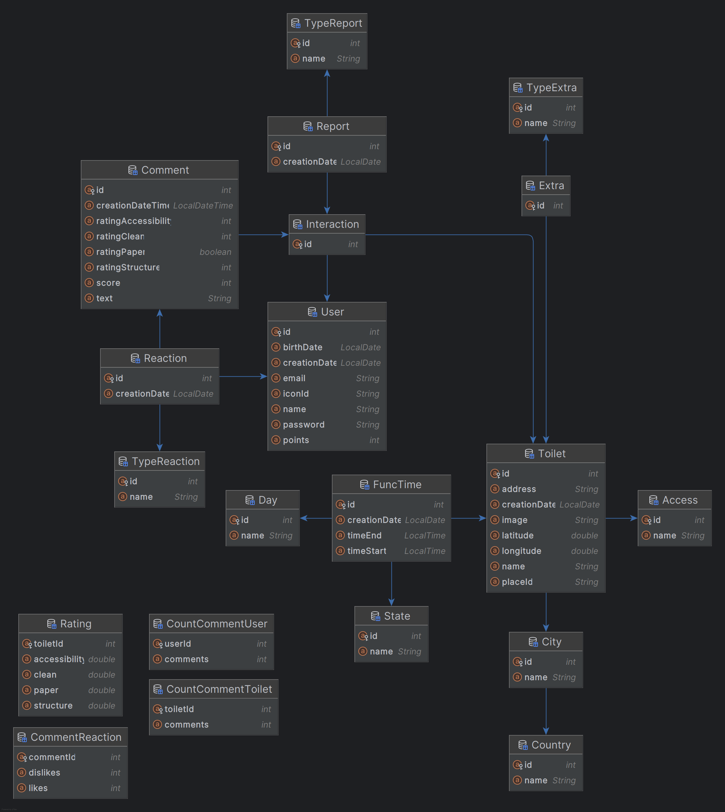
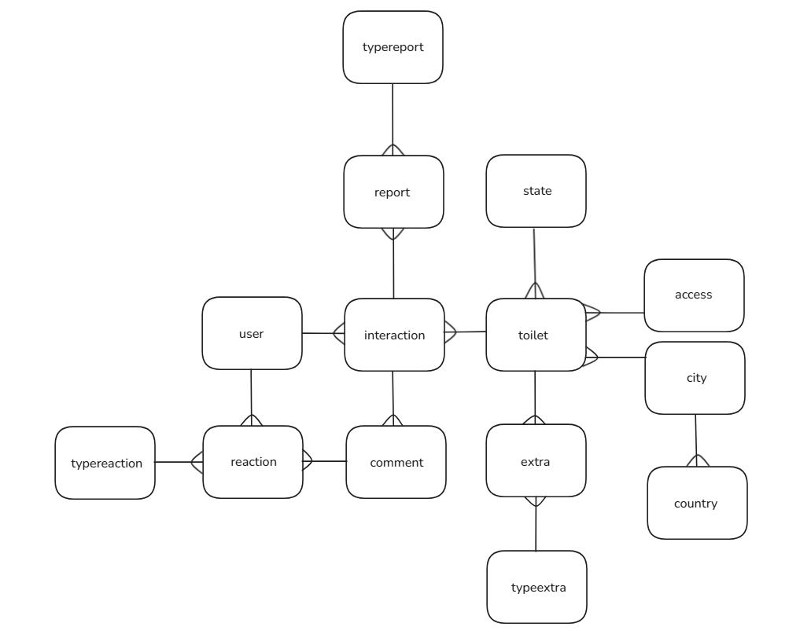

# Think Toilet - [IADE](https://www.iade.europeia.pt/) - [UE](https://www.europeia.pt/)  

**Universidade:** [Universidade Europeia](https://www.europeia.pt/)  
**Faculdade:** [IADE - Faculdade de Design, Tecnologia e Comunicação](https://www.iade.europeia.pt/)  
**Repositório:** [think-toilet](https://github.com/nycocado/think-toilet)  
**Curso:** Engenharia Informática

## Índice
- [Think Toilet - IADE - UE](#think-toilet---iade---ue)
  - [Índice](#índice)
  - [Elementos do Grupo:](#elementos-do-grupo)
  - [Palavras-Chave](#palavras-chave)
  - [Descrição](#descrição)
    - [Motivação](#motivação)
    - [Objetivos](#objetivos)
  - [Público-Alvo](#público-alvo)
  - [Pesquisa de Mercado](#pesquisa-de-mercado)
    - [Where is the Toilet](#where-is-the-toilet)
    - [Berlin Toilet](#berlin-toilet)
    - [Flush](#flush)
    - [Where is Public Toilet](#where-is-public-toilet)
  - [Personas](#personas)
    - [Matilde Homão](#matilde-homão)
    - [David Barção](#david-barção)
    - [Maria Cunha](#maria-cunha)
  - [Guiões de Teste](#guiões-de-teste)
      - [Primeiro Caso (Matilde Homão) - Localizar a melhor casa de banho próxima](#primeiro-caso-matilde-homão---localizar-a-melhor-casa-de-banho-próxima)
    - [Segundo Caso (Maria Cunha) - Feedback da casa de banho](#segundo-caso-maria-cunha---feedback-da-casa-de-banho)
    - [Terceiro Caso (David Barção) - Pesquisar casa de banho específica](#terceiro-caso-david-barção---pesquisar-casa-de-banho-específica)
  - [Plano de Trabalho](#plano-de-trabalho)
  - [Descrição da Solução](#descrição-da-solução)
  - [Enquadramento das Unidades Curriculares](#enquadramento-das-unidades-curriculares)
    - [Programação de Dispositivos Móveis](#programação-de-dispositivos-móveis)
    - [Programação Orientada por Objetos](#programação-orientada-por-objetos)
    - [Bases de Dados](#bases-de-dados)
    - [Matemática Discreta](#matemática-discreta)
    - [Projeto de Desenvolvimento Móvel](#projeto-de-desenvolvimento-móvel)
    - [Competências Comunicacionais](#competências-comunicacionais)
  - [Requisitos Técnicos](#requisitos-técnicos)
    - [Requisitos Funcionais](#requisitos-funcionais)
    - [Requisitos Não Funcionais](#requisitos-não-funcionais)
  - [Arquitetura da Solução](#arquitetura-da-solução)
    - [Componentes da Arquitetura:](#componentes-da-arquitetura)
      - [Front-end (Aplicação Móvel)](#front-end-aplicação-móvel)
      - [Back-end (Servidor)](#back-end-servidor)
      - [Banco de Dados](#banco-de-dados)
    - [Fluxo de Dados:](#fluxo-de-dados)
      - [Busca de Casas de Banho](#busca-de-casas-de-banho)
      - [Avaliação de Casas de Banho](#avaliação-de-casas-de-banho)
      - [Sugestão de Novas Casas de Banho](#sugestão-de-novas-casas-de-banho)
      - [Visualização de Avaliações e Sugestões](#visualização-de-avaliações-e-sugestões)
      - [Visualização do Histórico de Avaliações](#visualização-do-histórico-de-avaliações)
  - [Tecnologias](#tecnologias)
    - [Desenvolvimento Móvel:](#desenvolvimento-móvel)
    - [Desenvolvimento Back-End:](#desenvolvimento-back-end)
    - [Bases de Dados:](#bases-de-dados-1)
    - [Prototipação:](#prototipação)
  - [Diagrama de Classes](#diagrama-de-classes)
  - [Planificação](#planificação)
  - [Mockups e Interface](#mockups-e-interface)
    - [Telas que aparecem no Guião de Testes:](#telas-que-aparecem-no-guião-de-testes)
    - [Telas que não aparecem no Guião de Testes:](#telas-que-não-aparecem-no-guião-de-testes)
      - [Casas de Banho:](#casas-de-banho)
      - [Usuário:](#usuário)
      - [Login:](#login)
      - [Denuncia:](#denuncia)
      - [Sugerir Casa de Banho:](#sugerir-casa-de-banho)
  - [Conclusão](#conclusão)
  - [Bibliografia](#bibliografia)
- [Dicionário de Dados](#dicionário-de-dados)
    - [Modelo Entidade-Relacionamento](#modelo-entidade-relacionamento)
    - [Documento de Referência](#documento-de-referência)
- [REST API](#rest-api)
  - [Introdução](#introdução)
  - [Endpoints](#endpoints)
    - [Mostrar usuários](#mostrar-usuários)
    - [Mostrar usuário por ID](#mostrar-usuário-por-id)
    - [Mostrar comentários de um usuário](#mostrar-comentários-de-um-usuário)
    - [Mostrar comentários de um usuário de forma paginada](#mostrar-comentários-de-um-usuário-de-forma-paginada)
    - [Mostrar casas de banho](#mostrar-casas-de-banho)
    - [Mostrar casas de banho de forma paginada](#mostrar-casas-de-banho-de-forma-paginada)
    - [Mostrar casas de banho por ID](#mostrar-casas-de-banho-por-id)
    - [Mostrar casas de banho próximas](#mostrar-casas-de-banho-próximas)
    - [Mostrar casas de banho próximas de forma paginada](#mostrar-casas-de-banho-próximas-de-forma-paginada)
    - [Mostrar comentários de uma casa de banho](#mostrar-comentários-de-uma-casa-de-banho)
    - [Mostrar comentários de uma casa de banho de forma paginada](#mostrar-comentários-de-uma-casa-de-banho-de-forma-paginada)

## Elementos do Grupo:
- [Nycolas Souza](https://github.com/nycocado) - 20230989
- [Luan Ribeiro](https://github.com/Ninjaok) - 20230692
- [Lohanne Guedes](https://github.com/Lohannecristina) - 20220085

## Palavras-Chave
Localizador; Avaliação; Sanitários; Casa de banho; Público; Privada; Busca; Próximas; Aplicação; Mobile; Guia; Navegação; Google Maps; Encontrar; Rotas; Busca; Mapa; Interativo; App; Recomendação;

## Descrição
O **[Think Toilet](https://github.com/nycocado/think-toilet)** é uma aplicação móvel projetada para resolver um problema comum: localizar casas de banho limpas e acessíveis. Muitas vezes, as pessoas enfrentam dificuldades para encontrar uma casa de banho, especialmente em situações de emergência ou em áreas desconhecidas.

### Motivação
O **["Spreadshit"](https://exame.com/pop/spreadshit-planilha-avalia-banheiros-empresas/)** foi um evento viral em 2022 que popularizou reviews humorísticas de casas de banho. A pandemia de COVID-19, que levou ao fechamento de muitos banheiros públicos, fez com que encontrar um banheiro acessível se tornasse um desafio.

Com o fechamento de estabelecimentos e preocupações sobre a limpeza dos banheiros disponíveis, as pessoas começaram a compartilhar suas experiências online, formando uma comunidade disposta a ajudar na busca por opções mais seguras e limpas.

Além disso, muitos sistemas de busca de banheiros não são atualizados, complicando a vida dos usuários. Com isso, percebemos a necessidade de uma solução prática e eficaz. Portanto, queremos desenvolver uma aplicação que ajude as pessoas a encontrar casas de banho limpas e acessíveis, permitindo também a avaliação e sugestão de novos locais, criando um banco de dados mais confiável e útil.

### Objetivos

- Facilitar a busca de casas de banho limpas e próximas.
- Permitir um ambiente saudável para o desenvolvimento da comunidade.
- Avaliação e feedback contínuos.
- Integração com mapas e navegação.

## Público-Alvo
O público-alvo da aplicação **[Think Toilet](https://github.com/nycocado/think-toilet)** inclui:
- Trabalhadores em trânsito, como motoristas e entregadores, que frequentemente necessitam de acesso a casas de banho durante o trabalho.
- Turistas e viajantes que estão explorando novas áreas e precisam localizar sanitários próximos.
- Pessoas com necessidades de acessibilidade, que buscam informações sobre instalações adaptadas.
- Profissionais que trabalham em campo, como trabalhadores da construção civil e eletricistas, que podem não ter acesso a instalações adequadas durante o dia de trabalho.

## Pesquisa de Mercado
A nossa pesquisa sobre aplicativos para busca de casas de banho foi um dos principais motivos para a escolha do tema do projeto. A maioria deles apresenta uma interface deficiente e poucas funções úteis além da localização dos sanitários.

### [Where is the Toilet](https://play.google.com/store/apps/details?id=com.iisrl.toilet.star.toilet_star&hl=pt_PT)
A aplicação funciona como um localizador de casas de banho, permitindo avaliações e a criação de novas.
- **Pontos Positivos:** Interface limpa, sem informações desnecessárias, facilitando a navegação.
- **Pontos Negativos:** Poucas casas de banho disponíveis. Apesar de parecer italiana, não encontramos opções na Itália. O sistema de busca é pouco intuitivo e o mapa não atualiza automaticamente, sendo necessário clicar para mostrar os banheiros próximos.
- **Melhorias Sugeridas:** Automatizar a adição de casas de banho usando APIs e implementar um sistema inteligente para filtrar banheiros próximos ao utilizador.

### [Berlin Toilet](https://play.google.com/store/apps/details?id=com.futurice.berlintoiletapp&hl=pt_PT)
É uma aplicação para localização de casas de banho, utilizando o Google Maps para indicar direções e permitindo avaliações categóricas.
- **Pontos Positivos:** Sistema de localização intuitivo, permite saber se o estabelecimento é pago e oferece acessibilidade.
- **Pontos Negativos:** Interface fraca, não permite comentários sobre as casas de banho e as notas dos utilizadores não aparecem de forma imediata.
- **Melhorias Sugeridas:** Exibir a média de notas dos utilizadores na tela inicial para facilitar a escolha, permitir comentários e melhorar a interface.

### [Flush](https://play.google.com/store/apps/details?id=toilet.samruston.com.toilet&hl=pt_PT)
Aplicação de localização de casas de banho.
- **Pontos Positivos:** Localiza rapidamente banheiros no mapa, indicando se são pagos, acessíveis ou trancados. Permite criar casas de banho e reportar problemas.
- **Pontos Negativos:** Falta filtragem nas criações, avaliações e comentários não aparecem, não mostra as casas de banho mais próximas e não permite traçar rotas.
- **Melhorias Sugeridas:** Filtrar criações de casas de banho, exibir avaliações e comentários, mostrar as mais próximas e permitir rotas.

### [Where is Public Toilet](https://play.google.com/store/apps/details?id=sfcapital.publictoiletinsouthaustralia&hl=pt_PT)
Aplicativo para localizar banheiros públicos, com informações úteis como avaliações e acessibilidade.
- **Pontos Positivos:** Lista de banheiros por distância, com avaliações, horários de funcionamento, favoritos e compartilhamento. Mostra pins no mapa e oferece rota.
- **Pontos Negativos:** Necessita baixar o banco de dados a cada instalação, o que é demorado. Não possui comentários e a interface é confusa e pouco intuitiva.
- **Melhorias Sugeridas:** Mostrar os pins de banheiros registrados ao entrar no aplicativo, adicionar a opção de compartilhamento e incluir um menu com funções extras.

## Personas  

### Matilde Homão  
- **Iade:** 21 anos
- **Sexo:** Feminino
- **Ocupação:** Motorista de aplicação e Estudante
- **Descrição:** Matilde é uma jovem motorista de aplicação que enfrenta diversos desafios no seu dia a dia, como deslocar-se por diferentes locais e gerir a rotina entre o trabalho e os estudos numa universidade de prestígio.
- **Objetivo:** Devido à natureza dinâmica do seu trabalho como motorista de aplicação, Matilde precisa localizar de forma rápida e eficiente casas de banho de qualidade em diferentes regiões.
- **Frustrações:** Dificuldade em encontrar casas de banho em locais desconhecidos ou remotos.

### David Barção
- **Iade:** 20 anos
- **Sexo:** Masculino
- **Ocupação:** Turista e Empreendedor 
- **Descrição:** David é um jovem empreendedor em busca de autoconhecimento, decidido a explorar o mundo após desenvolver uma carreira de sucesso. Viajar é a sua forma de se conectar consigo mesmo e com diferentes culturas.
- **Objetivo:** David procura as rotas mais eficientes para explorar novos países e, durante as suas viagens, precisa localizar casas de banho confortáveis e acessíveis em diferentes regiões.
- **Frustrações:** Devido às suas constantes viagens, David frequentemente desconhece as características e comodidades das regiões onde irá pernoitar. Por isso, sente a necessidade de uma aplicação que facilite a localização de casas de banho confortáveis e próximas.

### Maria Cunha
- **Iade:** 39 anos
- **Sexo:** Feminino
- **Ocupação:** Jornalista, Dentista e Gestante 
- **Descrição:** Maria, mãe diagnosticada com Síndrome de Laron, cuida de um bebé de 8 meses e enfrenta os desafios de uma rotina intensa. Para lidar com as necessidades do seu filho, precisa estar sempre preparada para trocar fraldas e oferecer cuidados adequados, mesmo em locais fora de casa.
- **Objetivo:** Localizar rapidamente casas de banho equipadas com fraldários que atendam a altos padrões de limpeza e conforto.
- **Frustrações:** Devido à sua rotina corrida, Maria encontra dificuldades em encontrar casas de banho adequadas e bem equipadas para cuidar do seu bebé, o que adiciona stress à sua jornada diária.

## Guiões de Teste
#### Primeiro Caso (Matilde Homão) - Localizar a melhor casa de banho próxima 
Consideramos a localização da melhor casa de banho próxima como o objetivo principal do projeto, seguindo estes passos: [(Exemplos)](#telas-que-aparecem-no-guião-de-testes)
- Matilde encontra-se num local desconhecido e precisa urgentemente de uma casa de banho.
- O Matilde acede à aplicação e visualiza o mapa. 
- No mapa, são exibidas as casas de banho mais próximas, organizadas de acordo com as avaliações dos usuários. Na parte inferior, aparece a primeira casa de banho, e Matilde pode deslizar para ver as cinco opções mais próximas.
- Independentemente do método escolhido para aceder à casa de banho, o Matilde será redirecionado para a janela da casa de banho escolhida.
- Nessa janela, o Matilde pode clicar no botão escrito "Abrir no Maps", que o levará ao Google Maps, onde poderá escolher a rota até à casa de banho.

### Segundo Caso (Maria Cunha) - Feedback da casa de banho
O segundo caso envolve a avaliação de uma casa de banho: [(Exemplos)](#telas-que-aparecem-no-guião-de-testes)
- Maria utilizou uma casa de banho e gostaria de avaliar a excelente experiência que teve, compartilhando seu feedback positivo sobre a limpeza, conforto e acessibilidade do local.
- O Maria acede à aplicação e visualiza o mapa.
- No mapa, são exibidas as casas de banho mais próximas, organizadas conforme as avaliações dos usuários. Na parte inferior, destaca-se a primeira casa de banho que Maria utilizou, seguindo a recomendação da aplicação.
- Após selecionar a primeira casa de banho, o Maria é redirecionado para a janela da casa de banho selecionada.
- Nessa janela, o Maria clica no botão "Avaliar" e é levado à tela de avaliações.
- Maria pode comentar sobre a sua experiência e avaliar categorias como "Limpeza", "Papel", "Estrutura" e "Acessibilidade".
  - Opcionalmente, o Maria pode responder a perguntas adicionais sobre o estado da casa de banho.
- Para concluir, o Maria clica no botão de confirmação para publicar a sua avaliação.

### Terceiro Caso (David Barção) - Pesquisar casa de banho específica
Este caso trata da busca por uma casa de banho específica pelo utilizador: [(Exemplos)](#telas-que-aparecem-no-guião-de-testes)
- David viajou para Lisboa, um destino que nunca havia visitado antes. Agora, hospedado em seu hotel, ele deseja planejar sua viagem como turista, explorando a capital de Portugal e seus principais pontos turísticos
- David acede à aplicação e visualiza o mapa.
- Na parte superior, clica no botão de pesquisa.
- O teclado é acionado, e o utilizador pode digitar a localização ou o nome do estabelecimento onde a casa de banho se encontra.
- David tem duas possibilidades:
  - Encontrar a casa de banho e visualizar a sua página.
  - Não encontrar, mas ter a opção de sugerir a sua existência.
- O processo termina após a realização da ação desejada.

## Plano de Trabalho
| **Fase**                            | **Descrição**                                                                                                                                                                                                                                                           | **Prazo**               |
| ----------------------------------- | ----------------------------------------------------------------------------------------------------------------------------------------------------------------------------------------------------------------------------------------------------------------------- | ----------------------- |
| **1. Planejamento e Prototipação**  | - Definição dos objetivos, escopo e requisitos do projeto. (Todos)<br> - Criação de protótipos da interface de usuário usando Figma. (Todos)                                                                                                                            | Entrega 1: [20/10/2024] |
| **2. Desenvolvimento do Protótipo** | - Implementação inicial da aplicação móvel em Kotlin com Jetpack Compose. (Todos)<br> - Desenvolvimento inicial do servidor com Spring Boot. (Nycolas)<br> - Desenvolvimento da base de dados MySQL. (Lohanne)<br> - Integração do Back-End com o Front-End (Luan)      | Entrega 2: [24/11/2024] |
| **3. Desenvolvimento Final**        | - Funcionalidades completas de busca, avaliação e sugestão. (Todos)<br> - Integração e refinamento com a API do Google Maps. (Luan e Nycolas)<br> - Finalização do servidor e das APIs. (Lohanne e Nycolas)                                                             | Entrega 3: [12/01/2024] |
| **4. Testes**                       | - Realização de testes unitários e de integração da aplicação. (Todos)<br> - Coleta de feedback de usuários e melhorias com base nas avaliações. (Todos)                                                                                                                | Entrega 3: [12/01/2024] |
| **5. Documentação**                 | - Criação do relatório final do projeto. (Todos)                                                                                                                                                                                                                        | Entrega 3: [12/01/2024] |

## Descrição da Solução
O projeto **[Think Toilet](https://github.com/nycocado/think-toilet)** é uma aplicação móvel que ajuda os utilizadores a encontrar e avaliar casas de banho próximas. A aplicação exibe um mapa interativo com as casas de banho mais bem avaliadas e fornece informações como preço, acessibilidade e restrições de uso (gratuito, público ou para clientes). Os utilizadores podem avaliar critérios como limpeza, acessibilidade, papel disponível e estrutura, além de deixar comentários. A aplicação também permite sugerir novas casas de banho, denunciar locais ou comentários inadequados e visualizar seu histórico de avaliações. Com integração ao Google Maps, oferece rotas para facilitar o acesso aos locais.

## Enquadramento das Unidades Curriculares
### Programação de Dispositivos Móveis
Para o desenvolvimento mobile, usaremos **[Kotlin](https://kotlinlang.org)** como linguagem principal, com **[Jetpack Compose](https://developer.android.com/compose)** no **[Android Studio](https://developer.android.com)**. Começaremos pela implementação de componentes de front-end, criando templates reutilizáveis para diferentes partes da aplicação, o que facilita a manutenção e escalabilidade. Além disso, integraremos APIs externas, como o **[Google Maps API](https://developers.google.com/maps)**, e exibiremos dados dinâmicos, como avaliações e rotas para casas de banho.

### Programação Orientada por Objetos
Nesta disciplina, usaremos o **[Java](https://www.java.com/)** com **[Spring Boot](https://spring.io)** para o back-end, conectando a interface ao banco de dados. O projeto seguirá a arquitetura **REST**, criando APIs que facilitam a comunicação entre o front-end e o back-end. Será utilizado o padrão **MVC** (Model-View-Controller) para separar a lógica de negócios, a interface e os dados. Conceitos como herança e polimorfismo também serão aplicados para otimizar o código em **[Java](https://www.java.com/)**.

### Bases de Dados
Usaremos o **[MySQL](https://www.mysql.com/)** para gerenciar o armazenamento das informações do projeto, aplicando os conceitos da disciplina de Bases de Dados. Isso garante uma estrutura eficiente e organizada, otimizando o acesso a dados como avaliações, sugestões e denúncias, com foco em segurança e desempenho.

### Matemática Discreta
A disciplina de Matemática Discreta fornecerá a lógica necessária para o funcionamento do banco de dados, front-end e back-end. Conceitos como grafos, lógica proposicional e teoria dos conjuntos serão utilizados para resolver problemas de organização e acesso eficiente a dados, garantindo uma lógica de controle e validação robusta e segura.

### Projeto de Desenvolvimento Móvel
Nesta disciplina, iremos planear e gerir todas as etapas do projeto, utilizando ferramentas de gestão para garantir a execução eficiente e dentro dos prazos. Feedbacks de design e desenvolvimento pessoal serão usados para melhorar a qualidade do projeto e desenvolver habilidades técnicas e interpessoais.

### Competências Comunicacionais
Esta disciplina será essencial para melhorar a comunicação interna da equipa e externa com clientes e utilizadores. Também fornecerá feedback sobre design e desenvolvimento pessoal, ajudando a melhorar a interface e a experiência do utilizador, garantindo que o projeto atenda às expectativas.

## Requisitos Técnicos
### Requisitos Funcionais
- Os usuários devem poder buscar casas de banho próximas por localização no mapa.
- Os usuários devem poder visualizar detalhes das casas de banho, incluindo preço, acessibilidade, condições e avaliações, com a média das avaliações categóricas e a média geral das avaliações.
- Os usuários devem poder avaliar casas de banho, deixando comentários e notas sobre limpeza, acessibilidade, disponibilidade de papel e estrutura.
- Os usuários devem poder sugerir novas casas de banho.
- Os usuários devem poder ver seu histórico de avaliações.
- A aplicação deve permitir que os usuários denunciem locais ou comentários inadequados.
- Os usúarios obrigatoriamente devem ser registrados e ter uma conta na plataforma para poder interagir com a comunidade

### Requisitos Não Funcionais
- A interface deve ser intuitiva e responsiva, proporcionando uma experiência de usuário agradável.
- O sistema deve permitir a moderação eficiente de comentários e sugestões, incluindo a análise de conteúdo para determinar se ele deve ser mantido, editado ou removido.
- A aplicação deve ser compatível com [Android 9 (API Level 28)]((https://developer.android.com/tools/releases/platforms#9.0)) ou superior.
- Deve ser utilizado [Kotlin](https://kotlinlang.org) com [Jetpack Compose](https://developer.android.com/compose) para a interface do usúario.
- Deve ser utilizado [Java](https://www.java.com/) com [Spring Boot](https://spring.io) para manipulação de dados.
- Utilização de [MySQL](https://www.mysql.com/) para o armazenamento de dados, incluindo informações sobre usuários, casas de banho, avaliações e sugestões.
- Todos os dados do usuário devem ser criptografados antes de serem armazenados.
- Integração com o [Google Maps API](https://developers.google.com/maps) para fornecer direções e exibir casas de banho no mapa.

## Arquitetura da Solução
A arquitetura da solução do projeto **[Think Toilet](https://github.com/nycocado/think-toilet)** é projetada para ser modular e escalável, abrangendo três componentes principais: o front-end (aplicação móvel), o back-end (servidor) e o banco de dados.

### Componentes da Arquitetura:
#### Front-end (Aplicação Móvel)
Desenvolvida em **[Kotlin](https://kotlinlang.org)** com  **[Jetpack Compose](https://developer.android.com/compose)** para a interface de usuário, a aplicação permitirá aos usuários buscar casas de banho, visualizar detalhes, fazer avaliações e sugerir novos locais. A integração com o **[Google Maps API](https://developers.google.com/maps)** fornecerá um mapa interativo com direções.

#### Back-end (Servidor)
Construído com **[Java](https://www.java.com/)** e **[Spring Boot](https://spring.io)**, o servidor implementará uma arquitetura RESTful para facilitar a comunicação entre o front-end e o back-end. Ele gerenciará dados sobre casas de banho, avaliações e usuários, garantindo a integridade das informações.

#### Banco de Dados
Utilizando **[MySQL](https://www.mysql.com/)**, o banco de dados será projetado para armazenar informações sobre usuários, casas de banho, avaliações e sugestões. A estrutura relacional garantirá eficiência nas consultas e integridade dos dados.

### Fluxo de Dados:
#### Busca de Casas de Banho
- O usuário pesquisa casas de banho na aplicação.
- A aplicação envia uma requisição ao servidor para obter dados das casas de banho.
- O servidor processa a requisição e retorna os dados ao front-end.

#### Avaliação de Casas de Banho
- O usuário seleciona uma casa de banho e fornece uma avaliação.
- A aplicação envia a avaliação ao servidor.
- O servidor armazena a avaliação no banco de dados e pode retornar uma confirmação ao usuário.

#### Sugestão de Novas Casas de Banho
- O usuário sugere uma nova casa de banho.
- A aplicação envia os detalhes da sugestão ao servidor.
- O servidor armazena a sugestão e notifica o usuário sobre a aceitação ou rejeição da proposta.

#### Visualização de Avaliações e Sugestões
- O usuário pode visualizar avaliações de outras casas de banho.
- O servidor responde às requisições de visualização com as avaliações armazenadas.

#### Visualização do Histórico de Avaliações
- O usuário solicita visualizar seu histórico de avaliações.
- A aplicação envia uma requisição ao servidor para obter o histórico de avaliações do usuário.
- O servidor processa a requisição e retorna o histórico de avaliações ao front-end.

## Tecnologias
### Desenvolvimento Móvel:
- **Linguagem:** [Kotlin](https://kotlinlang.org)
- **Framework:** [Jetpack Compose](https://developer.android.com/compose)
- **SDK:** [Android SDK 28](https://developer.android.com/tools/releases/platforms#9.0)
- **Integração:** [Google Maps API](https://developers.google.com/maps)

### Desenvolvimento Back-End:
- **Linguagem:** [Java](https://www.java.com/)
- **Framework:** [Spring Boot](https://spring.io)

### Bases de Dados:
- **Sistema de Gerenciamento:** [MySQL](https://www.mysql.com/)
- **Conexão:** via [Java](https://www.java.com/) com [Spring Boot](https://spring.io)

### Prototipação:
- **Software:** [Figma](https://www.figma.com/) para design e prototipação da interface do usuário.

## Diagrama de Classes


## Planificação 
[Gráfico de Gantt](documents/gantt/gantt.pdf)  
[ClickUp](https://app.clickup.com/9012385337/v/s/90121717706)

## Mockups e Interface
### Telas que aparecem no Guião de Testes:


### Telas que não aparecem no Guião de Testes:
#### Casas de Banho:
- [La Tavola di Firenze - Página da Casa de Banho](documents/primeira_entrega/interface/toilet_page/la_tavola_di_firenze.png)
- [Pastel de Nata - Página da Casa de Banho](documents/primeira_entrega/interface/toilet_page/pastel_de_nata.png)
- [Sabor e Estudo - Página da Casa de Banho](documents/primeira_entrega/interface/toilet_page/sabor_e_estudo.png)
- [Vista do Tejo - Página da Casa de Banho](documents/primeira_entrega/interface/toilet_page/sabor_e_estudo.png)
- [Avaliação](documents/primeira_entrega/interface/toilet_page/comment.png)

#### Usuário:
- [Usuário](documents/primeira_entrega/interface/user_page/user.png)
- [Configurações do Usuário](documents/primeira_entrega/interface/user_page/user_config.png)
- [Pontos do Usuário 01](documents/primeira_entrega/interface/user_page/user_points01.png)
- [Pontos do Usuário 02](documents/primeira_entrega/interface/user_page/user_points02.png)
- [Desafios do Usuário](documents/primeira_entrega/interface/user_page/user_missions.png)
- [Histórico](documents/primeira_entrega/interface/user_page/historic.png)

#### Login:
- [Login](documents/primeira_entrega/interface/login_page/login.png)
- [Registo 01](documents/primeira_entrega/interface/login_page/register01.png)
- [Registo 02](documents/primeira_entrega/interface/login_page/register02.png)

#### Denuncia:
- [Denúnciar - Casa de Banho](documents/primeira_entrega/interface/report_page/report_toilet.png)
- [Denúnciar - Avaliação](documents/primeira_entrega/interface/report_page/report_comment.png)
- [Denunciar - Finalização](documents/primeira_entrega/interface/report_page/report_thanks.png)

#### Sugerir Casa de Banho:
- [Sugerir Casa de Banho 01](documents/primeira_entrega/interface/suggest_page/suggest01.png)
- [Sugerir Casa de Banho 02](documents/primeira_entrega/interface/suggest_page/suggest02.png)
- [Sugerir Casa de Banho 03](documents/primeira_entrega/interface/suggest_page/suggest03.png)
- [Sugerir Casa de Banho 04](documents/primeira_entrega/interface/suggest_page/suggest04.png)
- [Sugerir Casa de Banho 05](documents/primeira_entrega/interface/suggest_page/suggest05.png)

## Conclusão
O **[Think Toilet](https://github.com/nycocado/think-toilet)** tem como principal objetivo fornecer uma solução eficaz para facilitar a localização de casas de banho públicas e privadas, ao mesmo tempo que melhora a experiência do utilizador através de um sistema de avaliações detalhadas. A aplicação permite que os utilizadores encontrem rapidamente casas de banho próximas, com base em critérios como limpeza, acessibilidade e preço. Além disso, o projeto visa promover a colaboração dos utilizadores através de sugestões de novos locais e avaliações, criando assim um banco de dados sempre atualizado e confiável.

Outro objetivo central é o incentivo à participação ativa, implementando um sistema de gamificação, onde os utilizadores são recompensados com pontos por suas contribuições, seja avaliando casas de banho ou sugerindo novos locais. Com a integração ao [Google Maps](https://www.google.pt/maps), a aplicação também visa facilitar o acesso, fornecendo rotas diretas para os utilizadores. Ao final, **[Think Toilet](https://github.com/nycocado/think-toilet)** busca não apenas atender a uma necessidade prática, mas também criar uma comunidade de utilizadores colaborativa e engajada, proporcionando uma solução abrangente e útil para o cotidiano de todos.

## Bibliografia
- [Spreadshit: por trás da famosa planilha que avalia banheiros de empresas - Revista Exame](https://exame.com/pop/spreadshit-planilha-avalia-banheiros-empresas/)
- [Where is the Toilet - Jaser182](https://play.google.com/store/apps/details?id=com.iisrl.toilet.star.toilet_star&hl=pt_PT)
- [Berlin Toilet - WallDecaux](https://play.google.com/store/apps/details?id=com.futurice.berlintoiletapp&hl=pt_PT)
- [Flush - Sam Ruston](https://play.google.com/store/apps/details?id=toilet.samruston.com.toilet&hl=pt_PT)
- [Where is Public Toilet - sfcapital](https://play.google.com/store/apps/details?id=sfcapital.publictoiletinsouthaustralia&hl=pt_PT)
- [Kotlin - Jetbrains](https://kotlinlang.org)
- [Jetpack Compose - Google](https://developer.android.com/compose)
- [Android Studio - Google](https://developer.android.com)
- [Google Maps - Google](https://www.google.pt/maps)
- [Google Maps API - Google](https://developers.google.com/maps)
- [Java - Oracle](https://www.java.com/)
- [Spring Boot - VMware Tanzu](https://spring.io)
- [MySQL - Oracle](https://www.mysql.com/)
- [Android SDK 28 - Google](https://developer.android.com/tools/releases/platforms#9.0)
- [Figma - Figma, Inc.](https://www.figma.com/)

# Dicionário de Dados
### Modelo Entidade-Relacionamento
  
### Documento de Referência
[BD Report - Dicionario e Guia de Dados](documents/g04-relatoriobd.pdf)

# REST API
## Introdução
A API do Think Toilet oferece acesso eficiente a informações sobre usuários, casas de banho e comentários, permitindo consultas, visualizações e interações organizadas. Desenvolvida para integração com a aplicação móvel, a API fornece dados atualizados e é compatível com outras plataformas.

Os dados são entregues em formato JSON, garantindo respostas consistentes e facilitando a integração com sistemas diversos. A estrutura dos dados e os endpoints são flexíveis, projetados para suportar expansões futuras e melhorias contínuas na aplicação.

## Endpoints
### Mostrar usuários
- **URL:**  
`/users`  
- **METHOD:**  
`GET`  
- **URL PARAMETHERS:**  
  - Optional:  
  `ids=[integers]` (default: all users)
- **SUCCESS RESPONSE:**  
  ```json
  [
    {
      "id": [integer],
      "name": [string],
      "points": [integer],
      "iconId": [alphanumeric],
      "numComments": [integer],
    },
  ]
  ```
- **ERROR RESPONSE:**
  ```json
  {
    "status": 500,
    "message": "An unexpected error occurred.",
    "timestamp": [datetime]
  }
  ``` 
- **SAMPLE CALL:**  
  ```kotlin
  @GET("users")
  suspend fun getUsers(
      @Query("ids") ids: List<Int>? = null
  ): List<User>
  ```

### Mostrar usuário por ID
- **URL:**  
`/users/:id`  
- **METHOD:**  
`GET`
- **URL PARAMETHERS:**  
  - Required:  
  `id=[integer]` 
- **SUCCESS RESPONSE:**
  ```json
  {
    "id": [integer],
    "name": [string],
    "points": [integer],
    "iconId": [alphanumeric],
    "numComments": [integer],
  }
  ```
- **ERROR RESPONSE:**
  ```json
  {
    "status": 404,
    "message": "User with id {id} not found.",
    "timestamp": [datetime]
  }
  ```
- **SAMPLE CALL:**
  ```kotlin
  @GET("users/{id}")
  suspend fun getUsersById(@Path("id") id: Int): User
  ```

### Mostrar comentários de um usuário
- **URL:**  
  `/users/:id/comments`
- **METHOD:**  
  `GET`
- **URL PARAMETHERS:**  
  - Required:  
  `id=[integer]`
- **SUCCESS RESPONSE:**
  ```json
  [
    {
      "id": [integer],
      "toiletId": [integer],
      "userId": [integer],
      "text": [string],
      "ratingClean": [integer],
      "ratingPaper": [boolean],
      "ratingStructure": [integer],
      "ratingAccessibility": [integer],
      "datetime": [datetime],
      "numLikes": [integer],
      "numDislikes": [integer],
      "score": [integer]
    },
  ]
  ```
- **ERROR RESPONSE:**
  ```json
  {
    "status": 404,
    "message": "Comment with user id {id} not found.",
    "timestamp": [datetime]
  }
  ```
- **SAMPLE CALL:**  
  ```kotlin
  @GET("users/{id}/comments")
  suspend fun getUserComments(@Path("id") id: Int): List<Comment>
  ```

### Mostrar comentários de um usuário de forma paginada
- **URL:**  
  `/users/:id/comments/page?size=:size&page=:page`
- **METHOD:**  
  `GET`
- **URL PARAMETHERS:**
- **Required:**  
  `id=[integer]`
- **Optional:**  
  `size=[integer]` (default: 20)  
  `page=[integer]` (default: 0)
- **SUCCESS RESPONSE:**
  ```json
  {
    "content": [
      {
        "id": [integer],
        "toiletId": [integer],
        "userId": [integer],
        "text": [string],
        "ratingClean": [integer],
        "ratingPaper": [boolean],
        "ratingStructure": [integer],
        "ratingAccessibility": [integer],
        "datetime": [datetime],
        "numLikes": [integer],
        "numDislikes": [integer],
        "score": [integer]
      },
    ],
    "page": {
      "size": [integer],
      "number": [integer],
      "totalElements": [integer],
      "totalPages": [integer]
    }
  }
  ```
- **ERROR RESPONSE:**
  ```json
  {
    "status": 404,
    "message": "Comment with user id {id} not found.",
    "timestamp": [datetime]
  }
  ```
- **SAMPLE CALL:**
  ```kotlin
  @GET("users/{id}/comments/page")
  suspend fun getUserCommentsPage(@Path("id") id: Int, @Query("size") size: Int, @Query("page") page: Int): PageResponse<Comment>
  ```

### Mostrar casas de banho
- **URL:**  
`/toilets`
- **METHOD:**  
`GET` 
- **URL PARAMETHERS:**  
  - Optional:  
  `ids=[integers]` (default: all toilets)
- **SUCCESS RESPONSE:**  
  ```json
  [
    {
      "id": [integer],
      "name": [string],
      "address": [string],
      "rating": {
        "clean": [decimal],
        "structure": [decimal],
        "accessibility": [decimal],
        "paper": [decimal],
      },
      "extras": [
        {
          "id": [integer],
          "name": [string],
        },
      ],
      "latitude": [decimal],
      "longitude": [decimal],
      "numComments": [integer],
      "placeId": [alphanumeric],
      "image": [alphanumeric],
      "comments": []
    },
  ]
  ```
- **ERROR RESPONSE:**
  ```json
  {
    "status": 500,
    "message": "An unexpected error occurred.",
    "timestamp": [datetime]
  }
  ```
- **SAMPLE CALL:**
  ```kotlin
  @GET("toilets")
  suspend fun getToilets(
      @Query("ids") ids: List<Int>? = null,
  ): List<Toilet>
  ```

### Mostrar casas de banho de forma paginada
- **URL:**  
  `/toilets/page?size=:size&page=:page`
- **METHOD:**  
  `GET`
- **URL PARAMETHERS:**  
  - Optional:  
  `size=[integer]` (default: 20)  
  `page=[integer]` (default: 0)
- **SUCCESS RESPONSE:**
  ```json
  {
    "content": [
      {
        "id": [integer],
        "name": [string],
        "address": [string],
        "rating": {
          "clean": [decimal],
          "structure": [decimal],
          "accessibility": [decimal],
          "paper": [decimal],
        },
        "extras": [
          {
            "id": [integer],
            "name": [string],
          },
        ],
        "latitude": [decimal],
        "longitude": [decimal],
        "numComments": [integer],
        "placeId": [alphanumeric],
        "image": [alphanumeric],
        "comments": []
      },
    ],
    "page": {
      "size": [integer],
      "number": [integer],
      "totalElements": [integer],
      "totalPages": [integer]
    }
  }
  ```
- **ERROR RESPONSE:**
  ```json
  {
    "status": 500,
    "message": "An unexpected error occurred.",
    "timestamp": [datetime]
  }
  ```
- **SAMPLE CALL:**
  ```kotlin
  @GET("toilets/page")
  suspend fun getToiletsPage(@Query("size") size: Int, @Query("page") page: Int): PageResponse<Toilet>
  ```

### Mostrar casas de banho por ID
- **URL:**  
  `/toilets/:id`
- **METHOD:**  
  `GET` 
- **URL PARAMETHERS:**
  - Required:  
  `id=[integer]`  
- **SUCCESS RESPONSE:**
  ```json
  {
    "id": [integer],
    "name": [string],
    "address": [string],
    "rating": {
      "clean": [decimal],
      "structure":  [decimal],
      "accessibility": [decimal],
      "paper": [decimal]
    },
    "extras": [
      {
        "id": [integer],
        "name": [string]
      },
    ],
    "latitude": [decimal],
    "longitude": [decimal],
    "numComments": [integer],
    "placeId": [alphanumeric],
    "image": [alphanumeric],
    "comments": []
  }
  ```
- **ERROR RESPONSE:**
  ```json
  {
    "status": 404,
    "message": "Toilet with id {id} not found.",
    "timestamp": [datetime]
  }
  ```
- **SAMPLE CALL:**
  ```kotlin
  @GET("toilets/{id}")
  suspend fun getToiletById(@Path("id") id: Int): Toilet
  ```

### Mostrar casas de banho próximas
- **URL:**  
  `/toilets/nearby?lat=:lat&lon=:lon`
- **METHOD:**  
  `GET`
- **URL PARAMETHERS:**  
  - Required:  
  `lat=[decimal]`  
  `lon=[decimal]`
- **SUCCESS RESPONSE:**  
  ```json
  [
    {
      "id": [integer],
      "name": [string],
      "address": [string],
      "rating": {
        "clean": [decimal],
        "structure": [decimal],
        "accessibility": [decimal],
        "paper": [decimal]
      },
      "extras": [
        {
          "id": [integer],
          "name": [string]
        },
      ],
      "latitude": [decimal],
      "longitude": [decimal],
      "numComments": [integer],
      "placeId": [alphanumeric],
      "image": [alphanumeric],
      "comments": []
    },
  ]
  ```
- **ERROR RESPONSE:**
  ```json
  {
    "status": 500,
    "message": "An unexpected error occurred.",
    "timestamp": [datetime]
  }
  ```
- **SAMPLE CALL:**
  ```kotlin
  @GET("toilets/nearby")
  suspend fun getNearbyToilets(@Query("lat") lat: Double, @Query("lon") lon: Double): List<Toilet>
  ```

### Mostrar casas de banho próximas de forma paginada
- **URL:**  
  `/toilets/nearby/page?lat=:lat&lon=:lon&size=:size&page=:page`
- **METHOD:**  
  `GET`
- **URL PARAMETHERS:**  
  - Required:  
  `lat=[decimal]`  
  `lon=[decimal]`
  - Optional:  
  `size=[integer]` (default: 20)  
  `page=[integer]` (default: 0)
- **SUCCESS RESPONSE:**  
  ```json
  {
    "content": [
      {
        "id": [integer],
        "name": [string],
        "address": [string],
        "rating": {
          "clean": [decimal],
          "structure": [decimal],
          "accessibility": [decimal],
          "paper": [decimal]
        },
        "extras": [
          {
            "id": [integer],
            "name": [string]
          },
        ],
        "latitude": [decimal],
        "longitude": [decimal],
        "numComments": [integer],
        "placeId": [alphanumeric],
        "image": [alphanumeric],
        "comments": []
      },
    ],
    "page": {
      "size": [integer],
      "number": [integer],
      "totalElements": [integer],
      "totalPages": [integer]
    }
  }
  ```
- **ERROR RESPONSE:**
  ```json
  {
    "status": 500,
    "message": "An unexpected error occurred.",
    "timestamp": [datetime]
  }
  ```
- **SAMPLE CALL:**
  ```kotlin
  @GET("toilets/nearby/page")
  suspend fun getNearbyToiletsPage(@Query("lat") lat: Double, @Query("lon") lon: Double, @Query("size") size: Int, @Query("page") page: Int): PageResponse<Toilet>
  ```

### Mostrar comentários de uma casa de banho
- **URL:**  
  `/toilets/:id/comments`
- **METHOD:**  
  `GET` 
- **URL PARAMETHERS:**  
  - Required:  
  `id=[integer]`
- **SUCCESS RESPONSE:**
  ```json
  [
    {
      "id": [integer],
      "toiletId": [integer],
      "userId": [integer],
      "text": [string],
      "ratingClean": [integer],
      "ratingPaper": [boolean],
      "ratingStructure": [integer],
      "ratingAccessibility": [integer],
      "datetime": [datetime],
      "numLikes": [integer],
      "numDislikes": [integer],
      "score": [integer]
    },
  ]
  ```
- **ERROR RESPONSE:**
  ```json
  {
    "status": 404,
    "message": "Comment with toilet id {id} not found.",
    "timestamp": [datetime]
  }
  ```
- **SAMPLE CALL:**
  ```kotlin
  @GET("toilets/{id}/comments")
  suspend fun getToiletComments(@Path("id") id: Int): List<Comment>
  ```

### Mostrar comentários de uma casa de banho de forma paginada
- **URL:**  
  `/toilets/:id/comments/page?size=:size&page=:page`
- **METHOD:**  
  `GET`
- **URL PARAMETHERS:**
  - **Required:**  
    `id=[integer]`
  - **Optional:**  
    `size=[integer]` (default: 20)  
    `page=[integer]` (default: 0)
- **SUCCESS RESPONSE:**
  ```json
  {
    "content": [
      {
        "id": [integer],
        "toiletId": [integer],
        "userId": [integer],
        "text": [string],
        "ratingClean": [integer],
        "ratingPaper": [boolean],
        "ratingStructure": [integer],
        "ratingAccessibility": [integer],
        "datetime": [datetime],
        "numLikes": [integer],
        "numDislikes": [integer],
        "score": [integer]
      },
    ],
    "page": {
      "size": [integer],
      "number": [integer],
      "totalElements": [integer],
      "totalPages": [integer]
    }
  }
  ```
- **ERROR RESPONSE:**
  ```json
  {
    "status": 404,
    "message": "Comment with toilet id {id} not found.",
    "timestamp": [datetime]
  }
  ```
- **SAMPLE CALL:**
  ```kotlin
  @GET("toilets/{id}/comments/page")
  suspend fun getToiletCommentsPage(@Path("id") id: Int, @Query("size") size: Int, @Query("page") page: Int): PageResponse<Comment>
  ```
